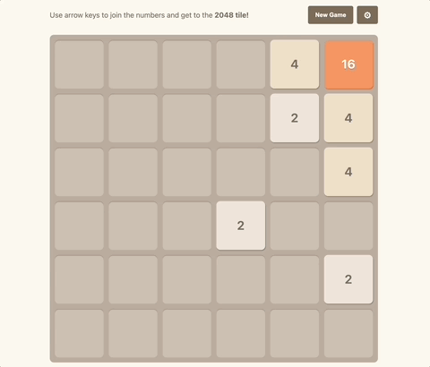

# 2048 game

[](https://github.com/aliaks-ei/game-2048/actions/workflows/unit-tests.yml)
[](https://github.com/aliaks-ei/game-2048/actions/workflows/e2e-tests.yml)
[](https://app.netlify.com/sites/game-2048-aliaksei/deploys)

A Vue 3 implementation of the classic 2048 game using Vite for fast builds and Pinia for efficient store management. This project features a clean, modern UI and smooth gameplay experience. The goal is to merge tiles by moving them around until a tile reaches the value of 2048.



## Live demo

Experience the live version of the game [here](https://game-2048-aliaksei.netlify.app/).

## Game overview

**Objective**: combine numbered tiles by moving them in any direction (up, down, left, right) to create a tile with a value of 2048. Each move spawns a new tile with a value of 2 or 4. When the grid is full and no more moves are possible, the game ends.

Configurable settings are available (grid size, obstacle count). These can be accessed from the “Settings” button on the main screen. Adjust settings and start a new game.

**Rules:**
- Press arrow keys to slide all tiles in a chosen direction.
- Tiles with the same value merge when they collide, combining into a single tile with double the value.
- Score increases with each tile merge. Aim for the highest score possible by creating the 2048 tile!

## Run the project locally

To set up and run this project on your local machine:

### Prerequisites

Ensure you have the following installed:

- Node.js (version 20 or above)

### Steps

**1. Clone the reposition**
```sh
git clone git@github.com:aliaks-ei/game-2048.git
cd game-2048
```

**2. Install dependencies:**
```sh
npm install
```

**3. Start the development server:**
```sh
npm run dev
```

**4. Open the game:** visit `http://localhost:5173` in your browser toplay the game locally.

## Testing

This project includes both unit tests and end-to-end (e2e) tests to ensure functionality.

### Unit tests

- **Scope**: covers components, utility functions, and store logic.
- **Testing tool**: [Vitest](https://vitest.dev/)
- **Run tests**: use the following command to run unit tests:

```sh
npm run test:unit:dev
```

### E2E tests

- **Scope**: ensures the full game flow is working as expected, including gameplay, scoring, and game-over scenarios.
- **Testing tool**: [Cypress](https://www.cypress.io/)
- **Run tests**: use the following command to run e2e tests:

```sh
npm run test:e2e:dev
```

## Documentation

A complete set of diagrams of the game’s architecture and component interactions is available on Miro: [Miro board - 2048 game diagrams](https://miro.com/app/board/uXjVLHVPWd8=/?share_link_id=325510651350)

### Folder structure and component diagrams

In-depth component diagrams, state management flow, and other resources can be found in the docs folder. These include:

- [Component diagram](./docs/diagrams/components_diagram.jpg): illustrates component hierarchy and interactions within the game.
- [Data flow diagram](./docs/diagrams/data_flow_diagram.jpg): visualizes data movement between user input, state updates, and rendering components, especially during tile movement and merging.
- [State diagram](./docs/diagrams/state_diagram.jpg): maps the primary game states, such as start, in-progress, win, and lose, to show transitions based on game events.

## Technologies and libraries

- **Vue 3**: For the core UI and component structure.
- **Vite**: For fast, modern development and optimized builds.
- **Pinia**: For managing game state (scores, grid structure, game-over state, etc.) in a reactive and organized way.
- **Cypress**: For reliable e2e testing.
- **Vitest**: For efficient and flexible unit testing.

### Frontend framework and tooling choices:
- **Vue 3 with Vite and Pinia**: Selected for its reactive data handling, modular component structure, and smooth integration with Vite for optimized builds. Vue’s reactivity system and Pinia’s structured state management allow seamless tracking and updating of the game state, especially critical in handling tile merging, score updates, and win/lose conditions.

**Alternative frameworks considered**: React and vanilla JavaScript were also considered, but Vue’s simple reactivity and Pinia’s clean API were ultimately preferred for more intuitive state management in this case.

## Performance optimization
Several optimization techniques are implemented to ensure smooth gameplay:
- **Optimized tile movement**: calculations for tile movement and merging are minimized to reduce re-renders;
- **Reduced re-renders**: Pinia’s reactivity allows tracking only relevant state updates, ensuring efficient UI updates and less computational load.